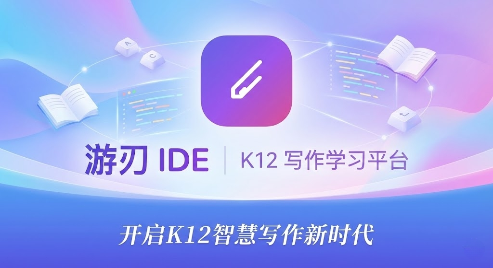
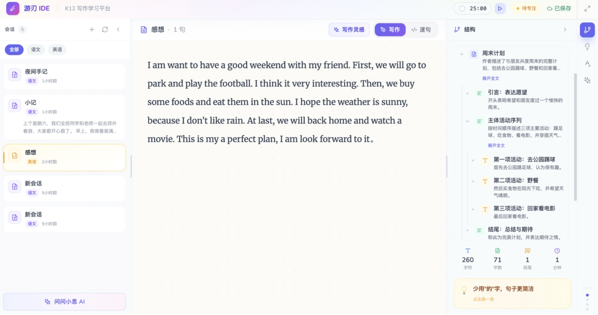

# K12 智能学习助手



面向 K12 学生的 AI 学习辅助平台，通过 AI 技术帮助学生提升写作能力和解题思维。



## 解决的问题

| 痛点 | 解决方案 |
|------|----------|
| 学生写作缺乏指导，不知道从何下笔 | AI 灵感引导，提供主题开头和写作方向 |
| 语法错误、错别字难以自查 | 实时语法检查，标注问题并给出修改建议 |
| 文章结构混乱，逻辑不清 | 结构分析树，可视化展示文章组织 |
| 不知道文章好不好，缺乏客观评价 | 多维度健康度评分（结构、连贯、清晰、语法、丰富度） |
| 理科解题步骤不知道对不对 | 步骤验证，逐步检查推导过程 |
| 解题思路不清晰 | 逻辑推导树，可视化解题路径 |
| 遇到问题没人问 | AI 对话助手，上下文感知，随时答疑 |

## 系统架构

```
┌─────────────────────────────────────────────────────────────────┐
│                         用户浏览器                               │
│  ┌─────────────────────────────────────────────────────────┐   │
│  │                    React 前端应用                         │   │
│  │  ┌──────────┐  ┌──────────┐  ┌──────────┐  ┌──────────┐ │   │
│  │  │ 编辑器    │  │ AI 对话  │  │ 辅助工具  │  │ 会话管理 │ │   │
│  │  │ (TipTap) │  │          │  │          │  │          │ │   │
│  │  └──────────┘  └──────────┘  └──────────┘  └──────────┘ │   │
│  └─────────────────────────────────────────────────────────┘   │
└─────────────────────────────────────────────────────────────────┘
                              │
                              │ HTTP / WebSocket
                              ▼
┌─────────────────────────────────────────────────────────────────┐
│                      FastAPI 后端服务                            │
│  ┌─────────────────────────────────────────────────────────┐   │
│  │                     API 路由层                            │   │
│  │  /sessions  /literature  /science  /chat  /ocr          │   │
│  └─────────────────────────────────────────────────────────┘   │
│  ┌─────────────────────────────────────────────────────────┐   │
│  │                    服务编排层                             │   │
│  │  SessionManager │ AgentCoordinator │ ModeDispatcher     │   │
│  └─────────────────────────────────────────────────────────┘   │
│  ┌─────────────────────────────────────────────────────────┐   │
│  │                    AI Agent 层                           │   │
│  │  GrammarChecker │ PolishAgent │ StructureAnalyzer       │   │
│  │  HealthScorer │ MathValidator │ LogicTreeBuilder        │   │
│  │  ChatAgent │ OCRAgent │ Debugger                        │   │
│  └─────────────────────────────────────────────────────────┘   │
│  ┌─────────────────────────────────────────────────────────┐   │
│  │                    LLM 调用层                            │   │
│  │              通义千问 (Qwen) API 封装                     │   │
│  └─────────────────────────────────────────────────────────┘   │
└─────────────────────────────────────────────────────────────────┘
                              │
              ┌───────────────┼───────────────┐
              ▼               ▼               ▼
        ┌──────────┐   ┌──────────┐   ┌──────────────┐
        │PostgreSQL│   │  Redis   │   │ 通义千问 API │
        │  数据库   │   │  缓存    │   │   (Qwen)    │
        └──────────┘   └──────────┘   └──────────────┘
```

## 核心链路

### 1. 写作辅助链路

```
用户输入 → 编辑器 → 防抖同步(1.5s) → 后端存储
                         ↓
              ┌──────────┴──────────┐
              ▼                     ▼
         语法检查               结构分析
              │                     │
              ▼                     ▼
    GrammarChecker Agent    StructureAnalyzer Agent
              │                     │
              ▼                     ▼
         Qwen API              Qwen API
              │                     │
              ▼                     ▼
      错误列表 + 建议          结构树 + 关系
              │                     │
              └──────────┬──────────┘
                         ▼
                    前端展示
```

### 2. AI 对话链路

```
用户提问 → 关联编辑器内容 → ChatAgent → Qwen API → 回复
              │
              ├─ 强关联词（润色、检查）→ 完整附带文章
              └─ 弱关联词（建议、技巧）→ 简要提及文章
```

### 3. 理科解题链路

```
题目输入 → 步骤拆解 → 逐步验证 → 逻辑树构建 → 断点调试
              │           │           │           │
              ▼           ▼           ▼           ▼
        MathValidator  MathValidator  LogicTree   Debugger
           Agent         Agent       Builder      Agent
```

## 功能模块

### 前端模块

| 模块 | 功能 | 技术实现 |
|------|------|----------|
| Editor | 双模式编辑器（写作/IDE） | TipTap + 自定义扩展 |
| WelcomeScreen | 写作灵感引导 | AI 生成主题开头 |
| AIChat | 智能对话助手 | 上下文感知对话 |
| GrammarCheck | 语法检查 | 错误标注 + 修改建议 |
| StructureTree | 结构分析 | 可视化树形结构 |
| HealthCheck | 健康度评估 | 五维度雷达图 |
| TextPolish | 文本润色 | 多版本润色建议 |
| FileTree | 会话管理 | 多会话切换 |

### 后端模块

| 模块 | 功能 | 说明 |
|------|------|------|
| SessionManager | 会话生命周期管理 | 创建、存储、版本控制 |
| AgentCoordinator | Agent 调度 | 统一调度各类 AI Agent |
| ModeDispatcher | 模式分发 | 文科/理科模式路由 |
| GrammarChecker | 语法检查 | 错别字、病句、语法错误 |
| PolishAgent | 文本润色 | 多风格润色 |
| StructureAnalyzer | 结构分析 | 段落层次、逻辑关系 |
| HealthScorer | 健康度评分 | 五维度评估 |
| MathValidator | 数学验证 | 步骤正确性验证 |
| LogicTreeBuilder | 逻辑树构建 | 推导路径可视化 |
| Debugger | 断点调试 | 变量追踪、状态检查 |
| ChatAgent | 对话助手 | 上下文感知回复 |
| OCRAgent | 图片识别 | 题目图片转文字 |

## 技术选型

| 层级 | 技术 | 选型理由 |
|------|------|----------|
| 前端框架 | React 18 | 生态成熟，组件化开发 |
| 构建工具 | Vite | 快速冷启动，HMR 体验好 |
| 富文本编辑器 | TipTap | 基于 ProseMirror，可扩展性强 |
| 样式方案 | Tailwind CSS | 原子化 CSS，开发效率高 |
| 动画库 | Framer Motion | 声明式动画，流畅自然 |
| 后端框架 | FastAPI | 异步支持好，自动生成文档 |
| 数据库 | PostgreSQL | 可靠稳定，JSON 支持好 |
| 缓存 | Redis | 高性能，支持多种数据结构 |
| ORM | SQLAlchemy 2.0 | 异步支持，类型提示完善 |
| AI 模型 | 通义千问 (Qwen) | 中文理解能力强，性价比高 |

## 数据流

### 编辑器同步

```
编辑器输入
    │
    ▼
防抖 1.5s ──────────────────────────────────────┐
    │                                           │
    ▼                                           │
POST /sessions/{id}/editor/sync                 │
    │                                           │
    ▼                                           │
Redis 缓存（实时内容）                            │
    │                                           │
    ▼                                           │
PostgreSQL（版本历史）                           │
    │                                           │
    ▼                                           │
返回 version + content_hash ◄───────────────────┘
```

### 语言模式自动切换

```
内容变化
    │
    ▼
检测语言 ─────┬───── 纯英文 ──→ 理科模式 (IDE)
              │
              └───── 含中文 ──→ 文科模式 (写作)
```

## 部署架构

```
                    ┌─────────────┐
                    │   Vercel    │
                    │  (前端CDN)  │
                    └──────┬──────┘
                           │
                           ▼
┌──────────────────────────────────────────────┐
│                   Railway                     │
│  ┌──────────┐  ┌──────────┐  ┌──────────┐   │
│  │ FastAPI  │  │PostgreSQL│  │  Redis   │   │
│  │  服务    │  │  数据库   │  │  缓存    │   │
│  └──────────┘  └──────────┘  └──────────┘   │
└──────────────────────────────────────────────┘
                           │
                           ▼
                  ┌─────────────────┐
                  │ 阿里云 DashScope │
                  │   (通义千问)     │
                  └─────────────────┘
```

## 快速开始

### 本地开发

```bash
# 克隆项目
git clone <repo-url>
cd k12-learning-assistant

# 启动后端
cd backend
poetry install
cp .env.example .env  # 配置 QWEN_API_KEY
docker-compose up -d postgres redis
poetry run uvicorn app.main:app --reload

# 启动前端
cd frontend
npm install
npm run dev
```

### Docker 一键启动

```bash
cd backend
export QWEN_API_KEY=sk-your-api-key
docker-compose up -d
```

## 项目结构

```
k12-learning-assistant/
├── frontend/                 # React 前端
│   ├── src/
│   │   ├── api/             # API 调用层
│   │   ├── components/      # 通用组件
│   │   ├── features/        # 功能模块
│   │   ├── hooks/           # 自定义 Hooks
│   │   ├── layouts/         # 布局组件
│   │   └── utils/           # 工具函数
│   └── README.md            # 前端文档
├── backend/                  # FastAPI 后端
│   ├── app/
│   │   ├── api/             # API 路由
│   │   ├── services/        # 业务逻辑
│   │   ├── repositories/    # 数据访问
│   │   ├── schemas/         # 数据模型
│   │   └── prompts/         # AI Prompt
│   └── README.md            # 后端文档
└── README.md                 # 本文档
```

## 未来规划

### 短期 (1-2 月)

- [ ] 支持更多文体（议论文、说明文、应用文）
- [ ] 增加写作模板库
- [ ] 优化 AI 响应速度（流式输出）
- [ ] 添加写作历史对比功能

### 中期 (3-6 月)

- [ ] 支持多学科（语文、英语、数学、物理）
- [ ] 增加知识点关联和推荐
- [ ] 支持班级/小组协作
- [ ] 教师端批改和点评功能

### 长期 (6-12 月)

- [ ] 个性化学习路径推荐
- [ ] 学习数据分析和报告
- [ ] 移动端 App
- [ ] 接入更多 AI 模型（支持模型切换）
- [ ] 支持语音输入和朗读

## 性能指标

| 指标 | 目标 | 当前 |
|------|------|------|
| 首屏加载 | < 2s | ~1.5s |
| 编辑器响应 | < 50ms | ~30ms |
| AI 分析响应 | < 5s | ~3s |
| 并发用户 | 1000+ | 测试中 |

## 贡献指南

1. Fork 项目
2. 创建特性分支 (`git checkout -b feature/xxx`)
3. 提交更改 (`git commit -m 'Add xxx'`)
4. 推送分支 (`git push origin feature/xxx`)
5. 创建 Pull Request

## 许可证

MIT License
