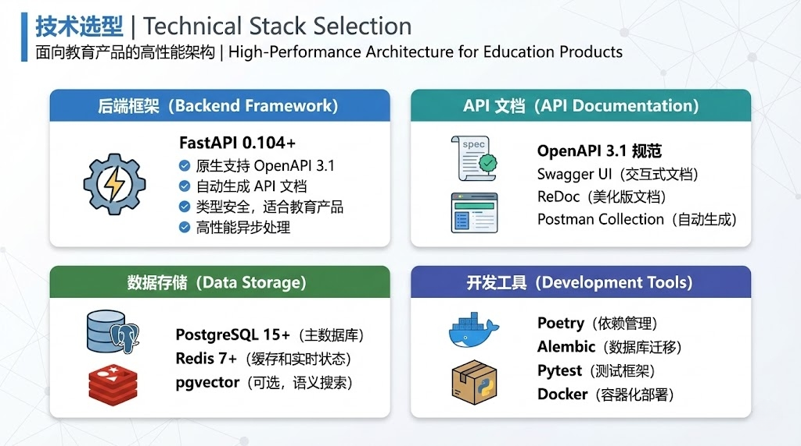

# K12 智能学习助手 - 后端服务

面向 K12 学生的 AI 学习辅助平台后端，提供文科写作辅助和理科解题分析能力。



## 技术栈

| 类别 | 技术 | 版本 |
|------|------|------|
| 框架 | FastAPI | ^0.104.0 |
| 运行时 | Python | ^3.11 |
| 数据库 | PostgreSQL (asyncpg) | 15 |
| 缓存 | Redis | 7 |
| ORM | SQLAlchemy | ^2.0.23 |
| 迁移 | Alembic | ^1.13.0 |
| AI | 通义千问 (Qwen) | - |
| 包管理 | Poetry | 1.7.1 |

## 项目结构

```
backend/
├── app/
│   ├── api/
│   │   ├── v1/                 # API 路由
│   │   │   ├── session.py      # 会话管理
│   │   │   ├── chat.py         # 智能对话
│   │   │   ├── literature.py   # 文科模式（语法检查、润色、结构分析）
│   │   │   ├── science.py      # 理科模式（步骤验证、逻辑树）
│   │   │   ├── ocr.py          # 图片文字识别
│   │   │   ├── feedback.py     # 用户反馈
│   │   │   └── system.py       # 系统状态
│   │   └── websocket.py        # WebSocket 实时通信
│   ├── services/
│   │   ├── agents/             # AI Agent 实现
│   │   ├── llm/                # LLM 调用封装
│   │   └── orchestrator/       # 会话管理、Agent 调度
│   ├── repositories/           # 数据访问层
│   ├── schemas/                # Pydantic 请求/响应模型
│   ├── database/               # 数据库连接和模型
│   ├── cache/                  # Redis 缓存策略
│   ├── core/                   # 日志、异常、中间件
│   ├── prompts/                # AI Prompt 模板
│   ├── utils/                  # 工具函数
│   ├── config.py               # 配置管理
│   └── main.py                 # 应用入口
├── scripts/                    # 部署脚本
├── Dockerfile
├── docker-compose.yml
├── pyproject.toml
└── alembic.ini
```

## 核心功能

### 1. 会话管理 (`/api/v1/sessions`)

| 端点 | 方法 | 说明 |
|------|------|------|
| `/sessions` | POST | 创建会话 |
| `/sessions` | GET | 获取会话列表 |
| `/sessions/{id}` | GET | 获取会话详情 |
| `/sessions/{id}` | PATCH | 更新会话 |
| `/sessions/{id}` | DELETE | 删除会话 |
| `/sessions/{id}/editor/sync` | POST | 同步编辑器内容 |
| `/sessions/{id}/editor/history` | GET | 获取编辑历史 |
| `/sessions/{id}/restore` | POST | 恢复到指定版本 |

### 2. 文科模式 (`/api/v1/literature`)

| 端点 | 方法 | 说明 |
|------|------|------|
| `/literature/check/grammar` | POST | 语法检查（错别字、病句） |
| `/literature/polish` | POST | 文本润色 |
| `/literature/structure/{id}` | GET | 获取文章结构 |
| `/literature/structure/analyze` | POST | 分析文章结构 |
| `/literature/health/{id}` | GET | 获取健康度评分 |
| `/literature/health/analyze` | POST | 评估文章健康度 |

### 3. 理科模式 (`/api/v1/science`)

| 端点 | 方法 | 说明 |
|------|------|------|
| `/science/steps/validate` | POST | 验证解题步骤 |
| `/science/steps/decompose` | POST | 拆解题目为步骤 |
| `/science/logic-tree/build` | POST | 构建逻辑推导树 |
| `/science/logic-tree/{id}` | GET | 获取逻辑树 |
| `/science/debug` | POST | 断点调试 |

### 4. 智能对话 (`/api/v1/chat`)

| 端点 | 方法 | 说明 |
|------|------|------|
| `/chat/message` | POST | 发送消息 |
| `/chat/history/{id}` | GET | 获取聊天历史 |
| `/chat/feedback` | POST | 反馈消息质量 |

### 5. WebSocket

```
ws://host/ws/session/{session_id}
```

用于实时同步编辑器状态和推送 AI 分析结果。

## 本地开发

### 环境要求

- Python 3.11+
- PostgreSQL 15+
- Redis 7+
- Poetry

### 快速启动

```bash
# 1. 安装依赖
poetry install

# 2. 配置环境变量
cp .env.example .env
# 编辑 .env，填入 QWEN_API_KEY

# 3. 启动依赖服务（使用 Docker）
docker-compose up -d postgres redis

# 4. 运行数据库迁移
poetry run alembic upgrade head

# 5. 启动开发服务器
poetry run uvicorn app.main:app --reload --port 8000
```

### 使用 Docker Compose 一键启动

```bash
# 设置 API Key
export QWEN_API_KEY=sk-your-api-key

# 启动所有服务
docker-compose up -d

# 查看日志
docker-compose logs -f api
```

## 环境变量

| 变量 | 说明 | 默认值 |
|------|------|--------|
| `DATABASE_URL` | PostgreSQL 连接串 | `postgresql+asyncpg://...` |
| `REDIS_URL` | Redis 连接串 | `redis://localhost:6379/0` |
| `QWEN_API_KEY` | 通义千问 API Key | 必填 |
| `QWEN_TEXT_MODEL` | 文本模型 | `qwen-max` |
| `QWEN_OCR_MODEL` | OCR 模型 | `qwen-vl-max` |
| `ENVIRONMENT` | 运行环境 | `development` |
| `LOG_LEVEL` | 日志级别 | `INFO` |
| `CORS_ORIGINS` | 允许的跨域源 | `http://localhost:3000,http://localhost:5173` |

## API 文档

启动服务后访问：

- Swagger UI: http://localhost:8000/docs
- ReDoc: http://localhost:8000/redoc
- OpenAPI JSON: http://localhost:8000/openapi.json

## 健康检查

```bash
curl http://localhost:8000/health
```

响应示例：

```json
{
  "status": "healthy",
  "version": "1.0.0",
  "environment": "production",
  "services": {
    "database": "up",
    "redis": "up"
  }
}
```

## 部署

### Railway 部署

项目已配置 `railway.json` 和 `railway.toml`，支持一键部署到 Railway。

需要在 Railway 中配置以下环境变量：
- `DATABASE_URL`（Railway 自动提供 PostgreSQL）
- `REDIS_URL`（Railway 自动提供 Redis）
- `QWEN_API_KEY`

### Docker 部署

```bash
# 构建镜像
docker build -t k12-backend .

# 运行容器
docker run -d \
  -p 8000:8000 \
  -e DATABASE_URL=... \
  -e REDIS_URL=... \
  -e QWEN_API_KEY=... \
  k12-backend
```

## 代码规范

```bash
# 格式化
poetry run black app/
poetry run isort app/

# 类型检查
poetry run mypy app/

# 代码检查
poetry run flake8 app/
```

## 测试

```bash
# 运行测试
poetry run pytest

# 带覆盖率
poetry run pytest --cov=app
```
