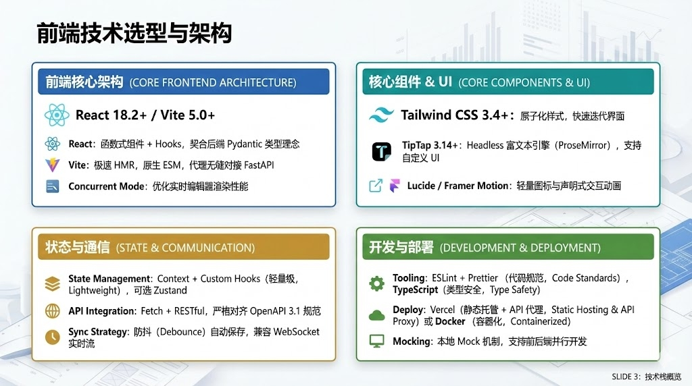
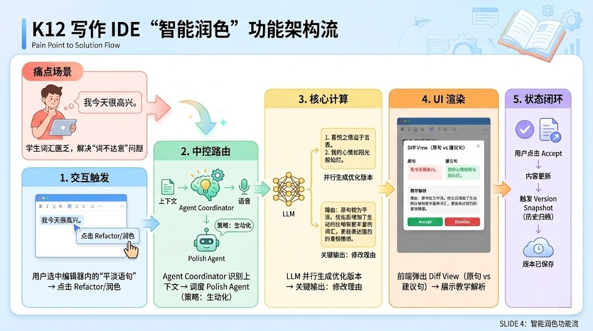

# K12 智能学习助手 - 前端

面向 K12 学生的 AI 学习辅助平台前端，提供沉浸式写作体验和智能辅助功能。



## 技术栈

| 类别 | 技术 | 版本 |
|------|------|------|
| 框架 | React | ^18.2.0 |
| 构建 | Vite | ^5.0.8 |
| 编辑器 | TipTap | ^3.14.0 |
| 样式 | Tailwind CSS | ^3.4.0 |
| 动画 | Framer Motion | ^10.16.16 |
| 图标 | Lucide React | ^0.294.0 |

## 项目结构

```
frontend/
├── src/
│   ├── api/                    # API 调用层
│   │   ├── index.js            # 统一导出
│   │   ├── sessionApi.js       # 会话管理
│   │   ├── chatApi.js          # 智能对话
│   │   ├── literatureApi.js    # 文科功能
│   │   └── systemApi.js        # 系统状态
│   ├── components/             # 通用组件
│   │   ├── ModeToggle.jsx      # 模式切换
│   │   └── ResizeHandle.jsx    # 面板拖拽
│   ├── features/               # 功能模块
│   │   ├── Editor/             # 编辑器
│   │   │   ├── Editor.jsx      # 编辑器入口
│   │   │   ├── WritingMode.jsx # 写作模式
│   │   │   ├── IDEMode.jsx     # IDE 模式
│   │   │   ├── WelcomeScreen.jsx
│   │   │   └── extensions/     # TipTap 扩展
│   │   ├── AIChat/             # AI 对话
│   │   ├── FileTree/           # 文件树/会话列表
│   │   ├── GrammarCheck/       # 语法检查
│   │   ├── HealthCheck/        # 健康度评估
│   │   ├── StructureTree/      # 结构分析
│   │   └── SystemStatus/       # 系统状态
│   ├── hooks/                  # 自定义 Hooks
│   │   ├── useSession.js       # 会话管理
│   │   └── useResizable.js     # 面板拖拽
│   ├── layouts/                # 布局组件
│   │   ├── Header.jsx          # 顶部栏
│   │   ├── LeftPanel.jsx       # 左侧面板
│   │   ├── RightPanel.jsx      # 右侧面板
│   │   └── EditorPanel.jsx     # 编辑器面板
│   ├── utils/                  # 工具函数
│   ├── App.jsx                 # 应用入口
│   ├── main.jsx                # 渲染入口
│   └── index.css               # 全局样式
├── index.html
├── vite.config.js
├── tailwind.config.js
├── postcss.config.js
└── package.json
```

## 核心功能

### 1. 双模式编辑器

| 模式 | 说明 | 触发条件 |
|------|------|----------|
| 写作模式 | 沉浸式写作，支持灵感引导 | 中文内容 |
| IDE 模式 | 代码风格，适合理科解题 | 纯英文内容 |

系统根据内容语言自动切换模式，也可手动切换。

### 2. 写作辅助功能



- **语法检查**：识别错别字、语法错误、病句
- **文本润色**：优化表达、丰富词汇
- **结构分析**：分析文章组织结构
- **健康度评分**：多维度评估文章质量

### 3. AI 对话助手

- 上下文感知，自动关联编辑器内容
- 支持快捷提问
- 聊天历史记录

### 4. 会话管理

- 多会话支持
- 自动保存（防抖 1.5s）
- 版本历史和恢复

## 本地开发

### 环境要求

- Node.js 18+
- npm 或 yarn

### 快速启动

```bash
# 安装依赖
npm install

# 启动开发服务器
npm run dev
```

开发服务器默认运行在 http://localhost:5173

### API 代理配置

开发环境下，API 请求会代理到后端服务：

```javascript
// vite.config.js
proxy: {
  '/api': {
    target: 'https://lovely-motivation-production.up.railway.app',
    changeOrigin: true,
    secure: true,
  },
}
```

如需连接本地后端，修改 `target` 为 `http://localhost:8000`。

## 构建部署

```bash
# 构建生产版本
npm run build

# 预览构建结果
npm run preview
```

构建产物在 `dist/` 目录。

### Vercel 部署

项目已配置 `vercel.json`，支持一键部署到 Vercel。

```json
{
  "rewrites": [
    { "source": "/api/:path*", "destination": "https://backend-url/api/:path*" }
  ]
}
```

## 组件说明

### Editor

编辑器核心组件，根据 `isIDEMode` 切换渲染模式。

```jsx
<Editor
  isIDEMode={false}
  content={content}
  setContent={handleContentChange}
  sessionId={sessionId}
  inspiration={inspiration}
  setInspiration={setInspiration}
/>
```

### AIChat

AI 对话组件，自动关联编辑器内容。

```jsx
<AIChat sessionId={sessionId} editorContent={content} />
```

关联逻辑：
- 强关联词（润色、检查、修改等）：完整附带编辑器内容
- 弱关联词（建议、技巧等）：简要提及文章内容

### GrammarCheck

语法检查组件，展示检查结果和修改建议。

```jsx
<GrammarCheck sessionId={sessionId} content={content} />
```

## API 调用

所有 API 调用封装在 `src/api/` 目录：

```javascript
import { 
  createSession, 
  getSession, 
  syncEditor 
} from './api'

// 创建会话
const session = await createSession({
  user_id: 'user-123',
  mode: 'literature',
  title: '我的作文'
})

// 同步编辑器内容
await syncEditor(sessionId, { content: '...' })
```

### Mock 模式

开发时可切换到 Mock 数据，无需后端：

```javascript
// src/api/index.js
// 使用 mock 数据
export * from './mockSessionApi'

// 使用真实 API
// export * from './sessionApi'
```

## 样式定制

### Tailwind 配置

```javascript
// tailwind.config.js
module.exports = {
  content: ['./index.html', './src/**/*.{js,jsx}'],
  theme: {
    extend: {
      // 自定义配置
    }
  }
}
```

### 编辑器样式

编辑器样式在 `src/index.css` 中定义：

```css
.writing-editor {
  /* 写作模式样式 */
}

.is-editor-empty::before {
  /* 占位符样式 */
}
```

## 状态管理

项目使用 React 内置状态管理：

- `useState` + `useCallback`：组件状态
- `useRef`：防抖定时器、上次同步内容
- Props 传递：父子组件通信

状态流向：

```
App (全局状态)
├── content, currentSession
├── inspirationMap (按 sessionId 存储)
└── syncing, lastSaved

↓ Props

LeftPanel (会话列表)
EditorPanel (编辑器)
RightPanel (辅助功能)
```

## 性能优化

1. **防抖同步**：编辑器内容变化后 1.5s 才同步到后端
2. **按需加载**：辅助功能按需调用 API
3. **缓存结果**：语法检查等结果支持缓存
4. **虚拟滚动**：长列表使用虚拟滚动（待实现）
